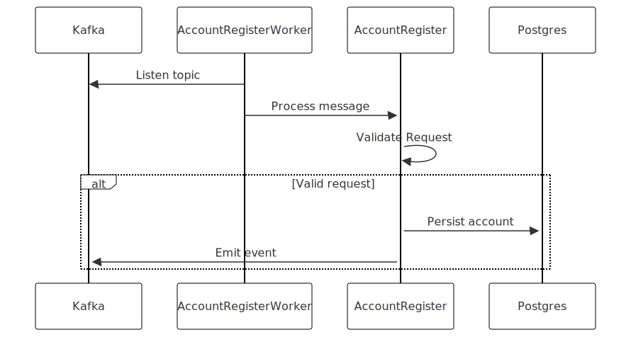
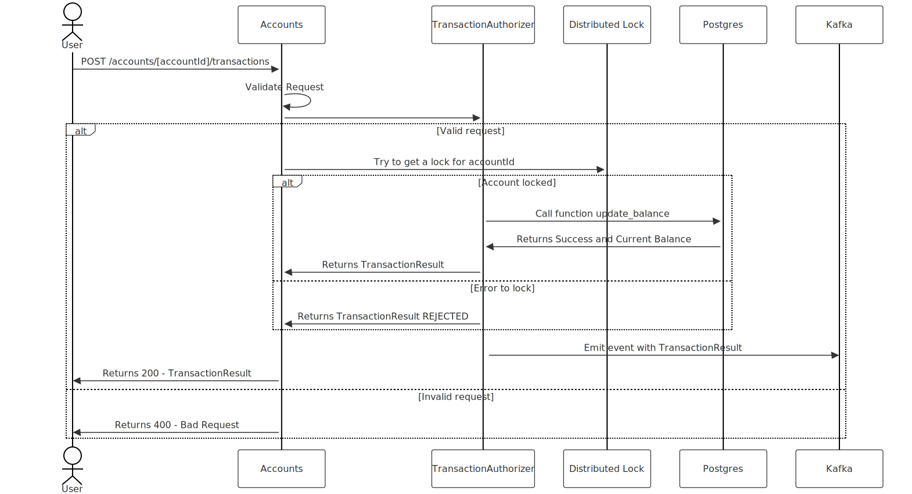
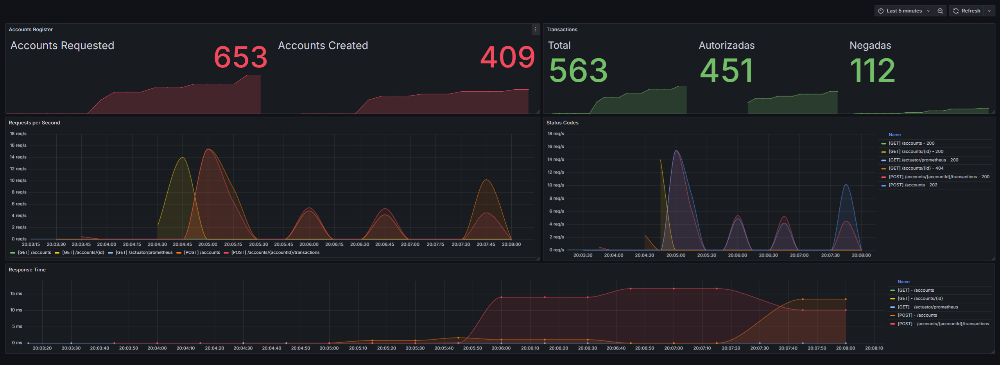

# MyBank: Desafio técnico para gestão de contas e saldos

## O Problema

Implementar as interfaces de abertura de conta e efetivação de transações(débito e credito), levando em consideração a garantia da consistencia dos dados, suporte a um alto volume de transações, desacoplamento, baixo tempo de resposta e possibilidade de evolução.

## Contas

#### Jornada 01: Abertura de Contas
Visando o desacoplamento da jornada, assim como num banco de verdade, a abertura de contas será assincrona e foi pensada de forma que uma mensagem num Tópico Kafka inicie o processo de abertura.

Exemplo: Um motor de analise de propostas aprova a proposta e solicita a abertura da conta de forma assincrona.

Nesse projeto não teremos o fluxo de propostas para inserir uma mensagem no tópico (`accounts-request`), então para simular isso foi criado o endpoint:

`POST /accounts`
```json
{
    "name": "João da Silva",
    "birth_date": "1999-11-01",
    "documents": [
        {
            "type": "CPF",
            "number": "111.111.333-11"
        },
        {
            "type": "RG",
            "number": "111.111.333-33"
        }
    ],
    "address": {
        "street": "Rua dos Bobos",
        "number": "0A",
        "city": "SÃO PAULO",
        "state": "SP"
    },
    "contact_info": [
        {
            "type": "PHONE",
            "number": "(11) 4002-8922"
        },
        {
            "type": "EMAIL",
            "number": "joazinhomaismais@email-legal.com.br"
        }
    ]
}
```
Onde
- `name` deve ser uma string de 1 a 50 caracteres **(obrigatório)**.
- `birthday_date` deve ser uma data válida **(obrigatório)**.

- `documents` deve ser um array de objetos com as seguintes propriedades **(obrigatório)**:
    - `type` deve ser uma string de 0 a 50 caracteres.
    - `number` deve ser uma string de 0 a 50 caracteres.

    Obs.: Para o array de documentos é obrigatorio pelo menos um objeto do tipo CPF.

- `address` deve ser um array de objetos com as seguintes propriedades **(opcional)**:
    - `street` deve ser uma string de 0 a 50 caracteres.
    - `number` deve ser uma string de 0 a 10 caracteres.
    - `city` deve ser uma string de 0 a 50 caracteres.
    - `state` deve ser uma string de 0 a 2 caracteres.

- `contact_info` deve ser um array de objetos com as seguintes propriedades **(opcional)**:
    - `type` deve ser uma string de 0 a 50 caracteres.
    - `number` deve ser uma string de 0 a 50 caracteres.

**Resposta**

`HTTP 202 Accepted`

**Regras**

Os campos **Nome**, **CPF** e **Data de Nascimento** são obrigatorios e a idade minima é **18 anos**. Caso essas condições não sejam satisfeitas, a API devera retornar Status Code 400 - Bad Request.

**Observações**

* Toda solicitação de abertura(`account_requested_counter_total`) e efetivação de conta(`account_created_counter_total`) geram métricas.
* Toda efetivação de conta gera um evento num tópico kafka (`accounts-registers`)

**Fluxo de abertura de contas:**



#### Jornada 02: Gestão de Contas

O processamento da abertura de contas será assincrono e para consultar as contas, podemos buscar pelo numero do documento ou pelo ID através dos endpoints abaixo:

`GET /accounts?documentType=[documentType]&documentNumber=[documentNumber]`

Onde
- `[documentType]` (query parameter) deve ser o tipo de documento informado na abertura da conta.
- `[documentNumber]` (query parameter) deve ser o numero do documento correspondente ao tipo informado na abertura da conta.

**Resposta**

`HTTP 200 OK`
```json
[
	{
		"id": "0ea7aba7-8715-4b29-b943-e9466ee0b9f7",
		"balance": 987.74
	},
	{
		"id": "81075c43-4aae-4388-a32d-22fe1de9ca10",
		"balance": 0.00
	}
]
```
Onde
- `id` deve ser um UUID representando o identificador unico da conta.
- `balance` deve ser o saldo atual da conta.

`GET /accounts/[id]`

Onde
- `[id]` (route parameter) deve ser um UUID representando o identificador unico de uma conta.

**Resposta**

`HTTP 200 OK`
```json
{
  "id": "69f38532-f59a-432c-bfd3-96cb2d955eda",
  "balance": 0
}
```
Onde
- `id` deve ser um UUID representando o identificador unico de uma proposta.
- `balance` deve ser o saldo atual.

## Transações

Para realizar o DÉBITO ou CRÉDITO de valores em uma conta, devemos submeter uma transação para ser autorizada. Esse endpoint realiza a autorização da transação e insere uma mensagem no tópico (`transactions`) para que outros sistemas possam ler essa informação de forma desacoplada (como por exemplo um Ledger que precisa registrar todas transações realizadas numa conta).

`POST /accounts/[accountId]/transactions`
```json
{
	"type": "D",
	"amount": 222.00,
	"description": "Compra Legal"
}
```
Onde
- `type` deve ser `C` para crédito ou `D` débito **(obrigatório)**.
- `amount` deve ser um número decimal que represente o valor da transação **(obrigatório)**.
- `description` deve ser uma string de 1 a 50 caracteres **(obrigatório)**.

**Resposta**

`HTTP 200 OK`
```json
{
	"timestamp": "2024-11-20T19:53:46.478166022",
	"status": "APPROVED",
	"type": "C",
	"amount": 222.00,
	"balance": 3996.00
}
```
Onde
- `timestamp` deve ser a data e hora que a transação foi processada.
- `status` deve representar o resultado da transação (`APPROVED` ou `REJECTED`).
- `type` deve ser o tipo de transação.
- `amount` deve ser um número decimal que represente o valor da transação.
- `balance` deve ser um número decimal que represente o saldo atual da conta.

**Regras**

Todos os campos são obrigatorios e caso essas condições não sejam satisfeitas, a API devera retornar Status Code 400 - Bad Request.

Uma transação de débito nunca pode deixar o saldo do cliente negativo, nesses casos a transação deve ser RECUSADA e não deve alterar o saldo.
Caso o saldo resultante fique zerado ou positivo, a transação de ser APROVADA e o valor subtraido do saldo.

Caso uma transação não possa ser efetivada, deve ser RECUSADA.

**Observações**

* Toda transação processada(`transaction.handled`) geram métricas.
* Toda transação processada gera um evento num tópico kafka (`transactions`)

**Fluxo de autorização de transações:**


# Executar a aplicação localmente
Execute os seguintes comandos no terminal:

Realiza o build da aplicação:
```
cd src\accounts
.\gradlew build
```

Inicializa os containers :
```
cd ..\..\infra
docker compose up
```

A aplicação terá iniciado na porta `8080` e você pode validar acessando o healthcheck pelo browser:

`http://localhost:8080/actuator/health`


Para visualizar as metricas, acesse o grafana na porta `3000`:

`http://localhost:3000/`

- Usuário: admin
- Senha: grafana



# Desenho de Arquitetura para AWS


# Principais Decisões
## Arquitetura Hexagonal: 
A arquitetura hexagonal, visa isolar a lógica de negócio da aplicação da infraestrutura externa (como banco de dados, APIs externas, sistemas legados e interfaces de usuário). Nesse modelo, a lógica de negócios é colocada no centro da aplicação, e a interação com o mundo externo acontece por meio de portas (ports) e adaptadores (adapters).

Vantagens:
- Desacoplamento: A lógica de negócios é isolada de detalhes de implementação, permitindo que componentes de infraestrutura sejam substituídos ou modificados sem impactar o núcleo.
- Facilidade de Testes: Com o núcleo desacoplado da infraestrutura, é possível testar a lógica de negócios de maneira independente. 
- Escalabilidade: Mudanças nas interfaces externas (como mudar o banco de dados ou adicionar novas integrações) não afetam a lógica interna da aplicação.
- Flexibilidade: A adição de novas funcionalidades ou integrações pode ser feita sem impactar o sistema existente, facilitando evoluções e refatorações.

## Kafka:
O Apache Kafka é uma plataforma distribuída de streaming de eventos, projetada para processar grandes volumes de dados em tempo real. Se destaca em cenários de comunicação assíncrona, processamento de eventos e integração entre sistemas.

Vantagens:
- Escalabilidade: Kafka é altamente escalável, permitindo o processamento de milhões de mensagens por segundo com baixa latência. Sua arquitetura distribuída permite adicionar novos nós facilmente.
- Resiliência: Kafka garante alta disponibilidade e tolerância a falhas, com replicação de dados e persistência.
- Processamento de Eventos em Tempo Real: Kafka é ideal para sistemas que necessitam processar grandes volumes de eventos em tempo real, como logs de sistema, monitoramento de métricas, eventos de usuários, etc.
- Desacoplamento: A arquitetura baseada em tópicos permite que produtores e consumidores de mensagens sejam desacoplados, facilitando a integração de novos serviços sem impacto direto.
- Persistência e Replay de Mensagens: Kafka mantém um log de todas as mensagens, permitindo que os consumidores leiam eventos anteriores, o que é útil para a reprocessamento de dados ou análise histórica.
- Suporte para Microserviços: Kafka facilita a comunicação entre microserviços e permite a implementação de arquiteturas orientadas a eventos.

## PostgreSQL:
O PostgreSQL é um sistema de gerenciamento de banco de dados relacional de código aberto que é conhecido por sua robustez, flexibilidade e conformidade com padrões SQL. Ele é amplamente utilizado em cenários que exigem consistência, integridade de dados e funcionalidades avançadas.

Vantagens:
- Suporte Completo a ACID: O PostgreSQL oferece total conformidade com as propriedades ACID (Atomicidade, Consistência, Isolamento e Durabilidade), garantindo a integridade dos dados em transações complexas.
- Escalabilidade Vertical e Horizontal: Embora a escalabilidade horizontal não seja tão simples quanto a de bancos de dados NoSQL, o PostgreSQL oferece várias soluções como particionamento de tabelas e replicação para escalar conforme necessário.
- Comunidade e Suporte: O PostgreSQL tem uma comunidade ativa e oferece uma rica documentação, o que facilita encontrar soluções para problemas comuns.
- Performance em Consultas Complexas: É particularmente bem-sucedido em consultas complexas e grandes volumes de dados relacionais, o que o torna adequado para sistemas que necessitam de operações analíticas intensivas.

## Uso de Lock Pessimista (usando SELECT FOR UPDATE) + Lock Distribuído
Optei por adotar uma abordagem híbrida para orquestrar a atualização do saldo e garantir a consistência dos dados.

Vantagens:
- Controle de Concorrência em Diferentes Níveis: O lock pessimista pode ser usado para controlar o acesso a dados no nível do banco de dados, enquanto o lock distribuído pode coordenar o acesso entre serviços diferentes, permitindo controle de concorrência eficaz em sistemas distribuídos.
- Redundância e Resiliência: Usando o lock distribuído, podemos garantir que os serviços distribuídos não tentem acessar o mesmo registro ao mesmo tempo, enquanto o lock pessimista no banco garante consistência dentro do próprio banco de dados.
- Escalabilidade com Controle de Concorrência: A combinação das duas abordagens pode permitir que o sistema se escale de maneira eficaz, mantendo a integridade e a consistência dos dados sem sobrecarregar o banco de dados com locks excessivos.